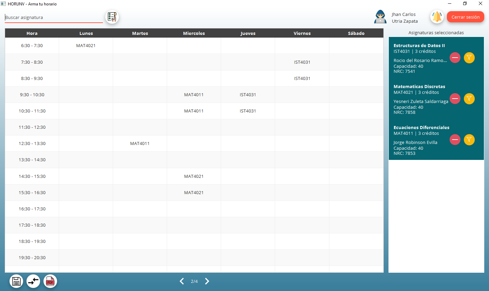

# HORUNV
HORUNV is a desktop application that makes it easy for students to create 
their academic schedule according to their projection. Some functionalities you will found are:

- Create schedules.
- Save to PDF.
- Save schedule in system with a given name.
- Compare stored schedules.
- Request other's student schedules.
- Find people with a schedule like yours.
- Filter by courses, professors and hours and days.

This application makes part of the final project of the Database subject at Universidad del Norte (Colombia), it was made using the libraries and software described below.

## Libraries and Software

- IntelliJ Idea (IDE)
- JavaFX (UI Framework)
- JFoenix (JavaFX library)
- OracleXE (Database)
- SqlDeveloper (Visual tool for OracleXE)
- iText 7 (Library for PDF functionalities)

## Contributors
<table>
<tr>
    <td align="center"> <b>Luis Camacho</b></a> </td>
    <td align="center"> <b>Jesús Imitola</b></a> </td>
    <td align="center"> <b>Miguel Nieto</b></a> </td>
    <td align="center"> <b>Jesús Reyes</b></a> </td>
    <td align="center"> <b>Jhan Utria</b></a> </td>
</tr>
</table>

## Credits
- [Login icon](src/assets/login.png) from [unDraw](https://undraw.co/search)
- [Schedule icon](src/assets/schedule.png) from [unDraw](https://undraw.co/search)
- [Negative icon](src/assets/negative.png) made by [Alfredo Hernandez](https://www.flaticon.com/authors/alfredo-hernandez "Alfredo Hernandez")
    from [www.flaticon.com](https://www.flaticon.com/ "Flaticon")
- [Man icon](src/assets/man.png) made by [Freepik](https://www.flaticon.es/autores/freepik "Freepik") from [www.flaticon.es](https://www.flaticon.es/ "Flaticon")
- [Woman icon](src/assets/woman.png) made by [Freepik](https://www.flaticon.com/authors/freepik "Freepik") from [www.flaticon.com](https://www.flaticon.com/ "Flaticon")
- [Filled circle](src/assets/filled_circle.png) made by [Freepik](https://www.flaticon.es/autores/freepik "Freepik") from [www.flaticon.es](https://www.flaticon.es/ "Flaticon")
- [Unfilled circle](src/assets/unfilled_circle.png) made by [Freepik](https://www.flaticon.es/autores/freepik "Freepik") from [www.flaticon.es](https://www.flaticon.es/ "Flaticon")
- [Information](src/assets/Information.png) made by [Freepik](https://www.flaticon.com/authors/freepik "Freepik") from [https://www.flaticon.com/ ]("Flaticon")
- [Plus circle](src/assets/plus.png) made by [Freepik](https://www.flaticon.es/autores/freepik "Freepik") from [www.flaticon.es](https://www.flaticon.es/ "Flaticon")
- [Right arrow](src/assets/right-arrow.png) and [right arrow](src/assets/right-arrow.png) hover
- [Left arrow](src/assets/left-arrow.png) and [left arrow hover](src/assets/left-arrow-hover.png) made by [Google](https://www.flaticon.com/authors/google "Google") from [www.flaticon.com](https://www.flaticon.com/ "Flaticon") 
- [Save icon](src/assets/save.png) made by [Freepik](https://www.flaticon.com/authors/freepik "Freepik") from [www.flaticon.com](https://www.flaticon.com/ "Flaticon")
- [Compare icon](src/assets/compare.png) made by [Google](https://www.flaticon.com/authors/google "Google") from [www.flaticon.com](https://www.flaticon.com/ "Flaticon")
- [Pdf icon](src/assets/pdf.png) made by [Freepik](https://www.flaticon.com/authors/freepik "Freepik") from [www.flaticon.com](https://www.flaticon.com/ "Flaticon")
- [List icon](src/assets/list.png) made by [Freepik](https://www.flaticon.com/authors/freepik "Freepik") from [www.flaticon.com](https://www.flaticon.com/ "Flaticon")
- [Notification icon](src/assets/notification.png) made by [Freepik](https://www.flaticon.com/authors/freepik "Freepik") from [www.flaticon.com](https://www.flaticon.com/ "Flaticon") 

